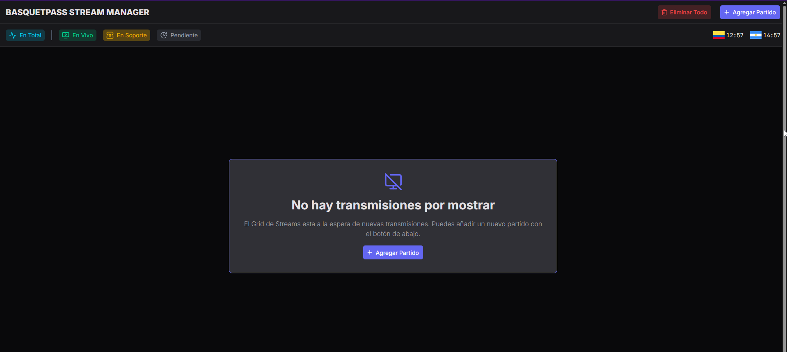
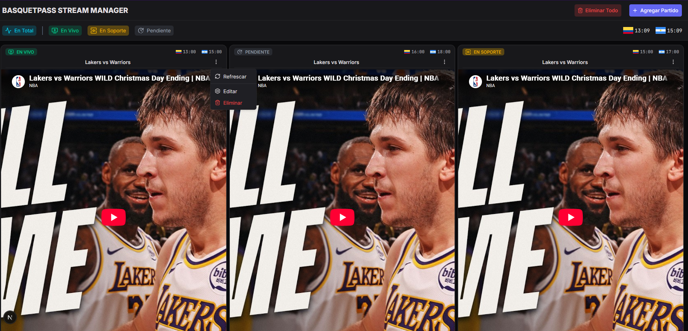
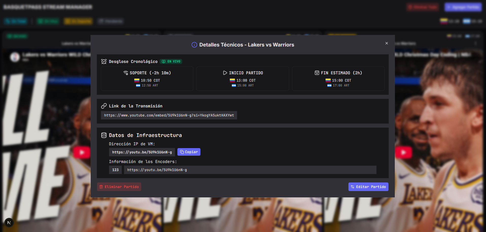
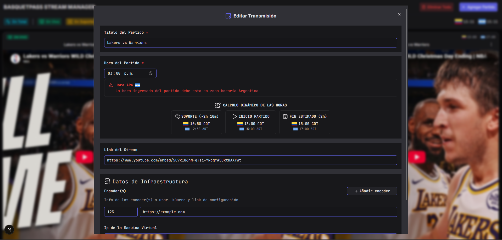

# 🎥 Multi-Stream Dashboard

Un dashboard de alto rendimiento para el monitoreo, gestión y administración de señales de video en tiempo real. Construido con **Next.js (App Router)**, **TypeScript** y **Zustand**.



## 📌 Contexto del Proyecto

Esta herramienta fue desarrollada de manera independiente para optimizar el flujo de trabajo en el área de **soporte técnico de señales de partidos de baloncesto en BasquetPass**. Nace de la necesidad de centralizar el monitoreo de las señales en tiempo real y agilizar la gestión de múltiples transmisiones en vivo durante la operación diaria.

## ⚠️ Nota de Privacidad y Seguridad

> **Descargo de responsabilidad:** Este repositorio **NO contiene ni expone** direcciones IP privadas, enlaces de transmisión internos, credenciales ni información confidencial de la empresa.
>
> La aplicación funciona exclusivamente como una interfaz de usuario (**Dashboard / UI**) desacoplada. Todos los datos mostrados son ingresados directamente por el usuario o simulados mediante datos de prueba (_mock data_) locales para fines de demostración.

## 🚀 Características Principales

- **Grilla de Transmisiones Dinámica:** Visualización simultánea de múltiples streams de video con reproductores integrados.
- **Cálculo de Estado en Tiempo Real:** Evaluación del estado (_Pendiente/En Soporte/En Vivo_) basada en la hora de inicio de la transmisión y disponibilidad de la señal. El Estado de cada partido se actualiza de forma automática.
- **Refresco Eficiente sin Re-renders:** Reinicio de reproductores `iframe` mediante _React Key Remounting_ (manipulación de estado local), evitando re-renderizados innecesarios del layout global. El uso de variables globales ayuda a evitar un _"prop-drilling"_ problemático.
- **Gestión Centralizada de Modales:** Flujo de modales orquestado mediante Zustand (_Información_, _Edición_, _Añadir_, _Eliminar_ y _ELiminar Todo_), garantizando una experiencia sin superposición de capas (_modal stacking_).
- **Acciones Rápidas de UI:**
  - Copiado directo de enlaces/IPs al portapapeles con feedback visual.
  - Links interactivos a transmisiones externas.
  - Indicadores visuales (_Badges_) condicionales basados en snapshots de fecha.

## 🛠️ Tech Stack

- **Framework:** [Next.js 14+](https://nextjs.org/) (App Router, exportación estática)
- **Lenguaje:** [TypeScript](https://www.typescriptlang.org/)
- **Escritorio:** [Tauri 2](https://tauri.app/)
- **Prototipado de UI**: [Google Stitch](https://stitch.withgoogle.com/)
- **Gestión de Estado:** [Zustand](https://zustand-demo.pmnd.rs/)(con `persist` en `localStorage`)
- **Librería de UI:** [Shadcn/UI](https://ui.shadcn.com/)
- **Estilos:** [Tailwind CSS](https://tailwindcss.com/)
- **Iconos:** [Lucide React](https://lucide.dev/)
- **Linter & Calidad:** Code Spell Checker (Español/Inglés) & ESLint

## 📸 Capturas de Pantalla

| Vista Principal                                      |
| ---------------------------------------------------- |
|  |

| Modal de Información                               | Modal de Edición                                   |
| -------------------------------------------------- | -------------------------------------------------- |
|  |  |

## 📂 Arquitectura del Proyecto

```text
├── src/
│   ├── app/                  # Rutas y layout principal de Next.js
│   ├── components/
│   │   ├── common/           # Componentes compartidos y reutilizables de la aplicación
│   │   ├── dashboard/        # Grilla de transmisiones, tarjetas y controles principales
│   │   ├── modals/           # Modales de gestión (Información, Edición y Formulario)
│   │   ├── providers/        # Proveedores de contexto global y configuración
│   │   └── ui/               # Componentes atómicos de Shadcn/UI (Dialog, Button, Badge, etc.)
│   ├── lib/                  # Configuraciones e integraciones de librerías secundarias
│   ├── store/                # Estado global centralizado con Zustand (useStreamStore, useModalStore)
│   ├── types/                # Definiciones e interfaces de TypeScript (Stream, Encoder, Status)
│   └── utils/                # Funciones helper puras (calculateStreamStatus, formateo de fechas)
└── src-tauri/                # Capa de escritorio (Tauri)
    ├── src/                  # Código Rust (punto de entrada de la app)
    ├── icons/                # Iconos generados para el ejecutable
    ├── capabilities/         # Permisos de la ventana
    └── tauri.conf.json       # Configuración de la app (nombre, ventana, identifier)
```

## 🖥️ Versión de Escritorio (Tauri)

La app puede empaquetarse como un ejecutable de Windows usando [Tauri](https://tauri.app/). Tauri no ejecuta Node: carga los archivos estáticos generados por Next.js dentro de un WebView del sistema (WebView2), lo que da como resultado una app liviana (~5-10 MB) con su propia ventana.

### ¿Cómo funciona?

Como la app es 100% frontend (sin API routes, Server Actions, middleware ni base de datos), Next.js se configura con `output: 'export'`. Al hacer `build`, se genera la carpeta `out/` con HTML, CSS y JS estáticos, y Tauri empaqueta esa carpeta dentro del `.exe`.

```text
Next.js (output: 'export')  →  out/  →  Tauri (WebView2)  →  bp-stream-manager.exe
```

### Requisitos para compilar

Solo son necesarios si vas a generar el ejecutable (no para desarrollar con `pnpm dev`):

1. **Rust:** instalar desde [rustup.rs](https://rustup.rs).
2. **Microsoft C++ Build Tools:** con la carga de trabajo _"Desarrollo para el escritorio con C++"_ ([descarga](https://visualstudio.microsoft.com/visual-cpp-build-tools/)).
3. **WebView2:** ya viene incluido en Windows 10/11.
   Verifica la instalación de Rust con `rustc --version`.

### Comandos

| Comando            | Qué hace                                                                                       |
| ------------------ | ---------------------------------------------------------------------------------------------- |
| `pnpm dev`         | Servidor de desarrollo en el navegador (`http://localhost:3000`). **Uso diario al programar.** |
| `pnpm tauri dev`   | Abre la app en una ventana de Tauri con hot reload (opcional).                                 |
| `pnpm build`       | Genera la exportación estática en `out/`.                                                      |
| `pnpm tauri build` | Compila el ejecutable y los instaladores.                                                      |

> 💡 **Flujo recomendado:** desarrolla con `pnpm dev` en el navegador. Usa `pnpm tauri dev` o `pnpm tauri build` solo cuando quieras probar o generar la versión de escritorio.

> ℹ️ `pnpm start` **ya no funciona**: con exportación estática Next.js no tiene servidor de producción. Para ver el build en el navegador, sirve la carpeta `out/` con `pnpm dlx serve out`.

### Salida de la compilación

Tras ejecutar `pnpm tauri build`, los archivos se generan en `src-tauri/target/release/`:

- `app.exe`: ejecutable portable. Se puede copiar a cualquier carpeta y crear un acceso directo.
- `bundle/nsis/*.exe` y `bundle/msi/*.msi`: instaladores de Windows.
  Para actualizar la app tras cambiar el código, basta con volver a ejecutar `pnpm tauri build`.

### Persistencia de datos

Zustand guarda el estado en `localStorage`, que en la versión de escritorio vive dentro de WebView2:

- **Persiste** entre cierres de la app y entre recompilaciones.
- **No se comparte con el navegador:** la app de escritorio usa un origen distinto (`tauri.localhost`) al de `localhost:3000`, por lo que cada una tiene sus datos independientes. Lo mismo aplica entre `pnpm tauri dev` y el `.exe` compilado.
- **No cambies el `identifier`** de `src-tauri/tauri.conf.json` (`com.basquetpass.streammanager`) una vez que empieces a usar la app, ya que los datos guardados se asocian a él y se perderían.

## 💻 Configuración Local

1. **Clonar el repositorio:**

   ```bash
   git clone [https://github.com/WilmerSoto/basquetpass-stream-manager.git](https://github.com/WilmerSoto/basquetpass-stream-manager.git)
   cd basquetpass-stream-manager
   ```

2. **Instalar dependencias:**

   ```bash
   npm install
   # o
   pnpm install
   ```

3. **Iniciar el servidor de desarrollo:**

   ```bash
   npm run dev
   # o
   pnpm dev
   ```

4. **(Opcional) Generar la app de escritorio:**
   Con los [requisitos](#requisitos-para-compilar) instalados:

```bash
   pnpm tauri build
```

El ejecutable queda en `src-tauri/target/release/app.exe`.
